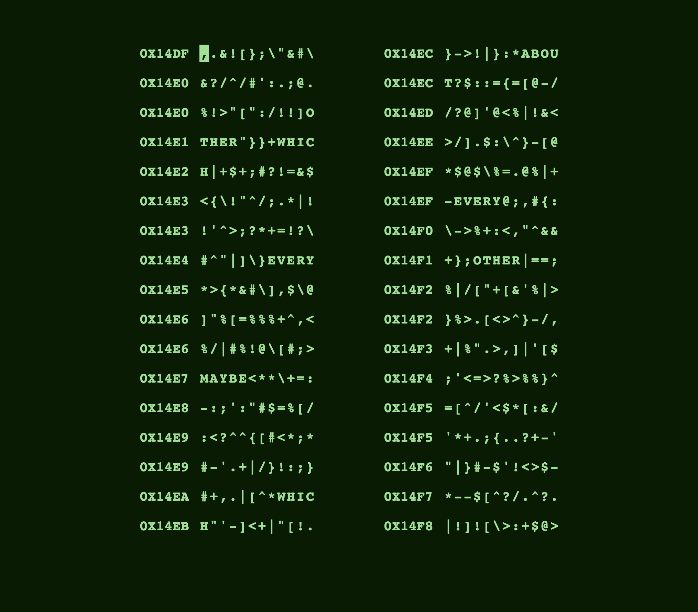

# Fallout Terminal

*An attempt of emulating Fallout's terminal*  
*mini-game using HTML, CSS and TypeScript.*

 
 

[![Button Demo]][Demo]   [![Button Specification]][Specification]

 
 

 
 

## Credits

- **[CRT Flickering Animation]**

 

<!----------------------------------------------------------------------------->

[CRT Flickering Animation]: http://aleclownes.com/2017/02/01/crt-display.html
[Specification]: Documentation/Specification.md

[Demo]: https://yrachid.github.io/fallout-terminal/

<!---------------------------------[ Buttons ]--------------------------------->

[Button Specification]: https://img.shields.io/badge/Specification-A5915F?style=for-the-badge&logoColor=white&logo=BookStack
[Button Demo]: https://img.shields.io/badge/Demo-4c854a?style=for-the-badge&logoColor=white&logo=AppleArcade
